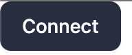
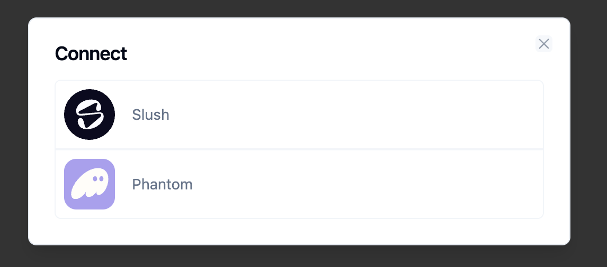
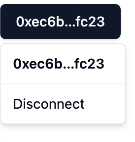

# Svelte Sui Wallet Adapter

A Sui wallet adapter for use with sveltekit and svelte 5.

Requires `tailwindcss 4+` and `shadcn-svelte`.

## Getting started

```bash
pnpm dlx @svelte-add/tailwindcss@latest
pnpm dlx shadcn-svelte@latest init
pnpm install bits-ui

pnpm dlx shadcn-svelte@latest add button
pnpm dlx shadcn-svelte@latest add dialog
pnpm dlx shadcn-svelte@latest add dropdown-menu

npm install @builders-of-stuff/svelte-sui-wallet-adapter
```

### Import the CSS

Add the component styles to your app. You have two options:

**Option 1: Import in your main layout or app file**

```js
// src/app.html or src/routes/+layout.svelte
import '@builders-of-stuff/svelte-sui-wallet-adapter/styles.css';
```

**Option 2: Import in your CSS file**

```css
/* src/app.css */
@import '@builders-of-stuff/svelte-sui-wallet-adapter/styles.css';
```

### Usage

```svelte
<!-- +page.svelte -->
<script lang="ts">
  import {
    ConnectButton,
    walletAdapter
  } from '@builders-of-stuff/svelte-sui-wallet-adapter';

  // Example call
  let example = await walletAdapter.signAndExecuteTransaction({
    transaction: tx as any,
    account: walletAdapter.currentAccount as any,
    chain: walletAdapter!.currentAccount!.chains[0],
    execute: async ({ bytes, signature }) =>
      await walletAdapter.suiClient.executeTransactionBlock({
        transactionBlock: bytes,
        signature,
        options: {
          // Raw effects are required so the effects can be reported back to the wallet
          showRawEffects: true,
          // Select additional data to return
          showObjectChanges: true
        }
      })
  });
</script>

<ConnectButton {walletAdapter} />
```







## Current known issues

- Client-side only, probably doesn't work with ssr

## Developing

Once you've created a project and installed dependencies with `npm install` (or `pnpm install` or `yarn`), start a development server:

```bash
npm run dev
```

Everything inside `src/lib` is part of the library, everything inside `src/routes` can be used as a showcase or preview app.
